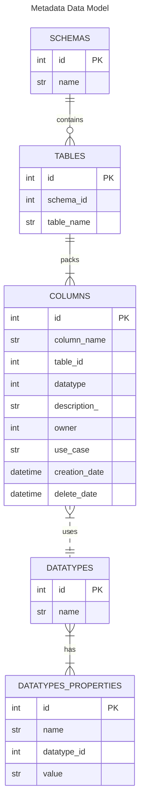

# MSD_Data_Catalog
MSD Interview Data Catalog

# Goals
Design a data cataloging system for a data warehouse so that a user can explore technical and business information about available schemas, tables and columns.

- Automatically ingest free public datasets (from Kaggle or elsewhere) to a database system of your choice. Include at least 10 schemas, each should have multiple tables.
- Create a data model representing the descriptions of your data. Include business information (e.g. what is the context of a column) which can be originating from a static extract.
- Present this metadata information to a user.
- Optionally, come up with an automated way to gather business information from users to enrich technical metadata without description.
- Store your source codes in a Git repository.

# Requirements

The execution of this script requires Python version 3.11 or superior

# Execution

On the terminal execute the following command

```terminal
.\execute.bat
```

This command will install all the required python dependencies and then will execute the main code

